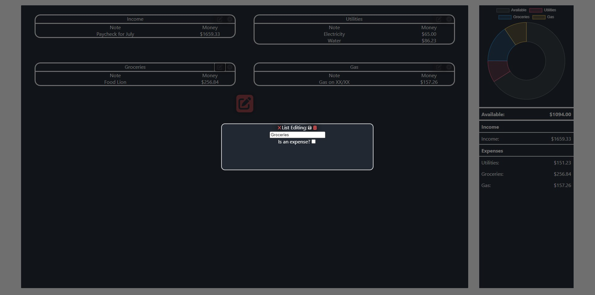

# Budget Web App

A self-hosted web application designed for simple, personal accounting and budgeting. This project was designed to provide a monthly log of income and expenses. The web application automatically saves as new entries are added, deleted, or edited and loads the log when the page is entered.

## Installation and Setup Guide

Requirements: Node.js, Git (preferred)

Download the repository by cloning or downloading the zip

Once in project directory

Set up the npm package by running in terminal: 

`npm init`

Install dependencies by running:

`npm install`

To start the web app run:

`npm run start`

## Pictures

